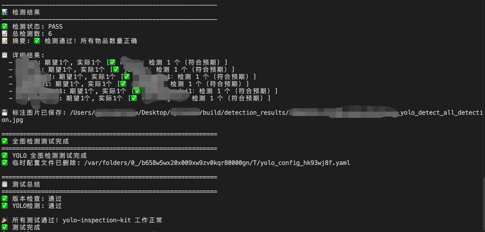
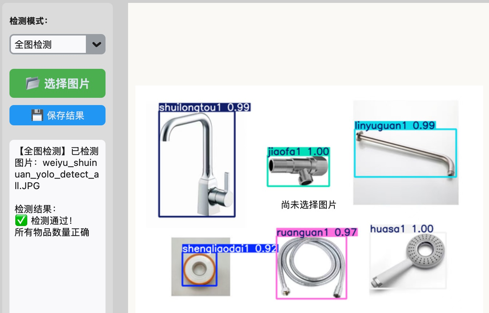
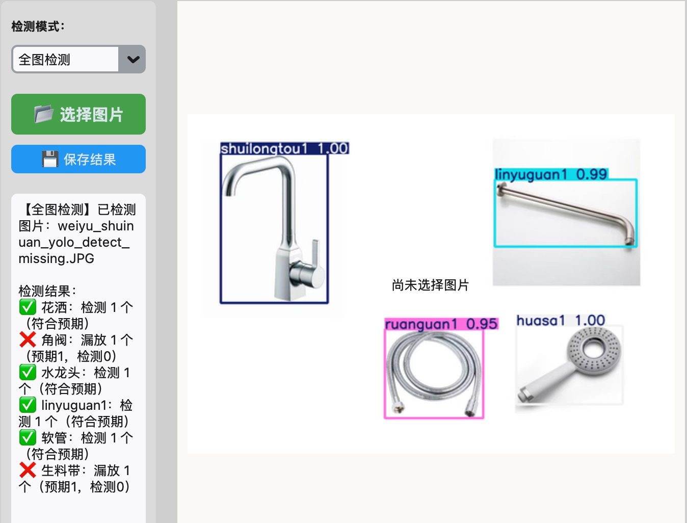

[中文](README_CN.md) | English

# YOLO Inspection Kit (yolo_inspection_kit)

A lightweight YOLO-based detection toolkit for product packaging verification and quality inspection, built on YOLOv8.

## 📋 Table of Contents
- [Features](#features)
- [Installation](#installation)
- [Quick Start](#quick-start)
- [Configuration](#configuration)
- [Usage Examples](#usage-examples)
- [API Documentation](#api-documentation)
- [FAQ](#faq)

## ✨ Features

- 🎯 **Full Image Detection** - Single-pass YOLO detection on entire image
- 🔍 **Multi-ROI Detection** - Divide image into regions and detect independently
- 📊 **Smart Analysis** - Automatically analyze results and identify missing/excess items
- ⚙️ **Flexible Configuration** - Support code parameters, config files, and environment variables
- 🖼️ **Visualization** - Generate images with detection boxes
- 🚀 **Easy Integration** - Simple API to get started in one line




## 📦 Installation

### Basic Installation

```bash
pip install yolo_inspection_kit
```

### Full Installation (with all dependencies)

```bash
pip install yolo_inspection_kit[all]
```

### Install from Source

```bash
git clone https://github.com/Json031/yolo_inspection_kit.git
cd yolo_inspection_kit
pip install -e .
```

## 🚀 Quick Start

### Four Configuration Methods

#### Method 1️⃣: Code Parameters (Recommended) ✨
```python
from yolo_inspection_kit import YoloInspector

# No config file needed - configure directly with parameters
inspector = YoloInspector(
    model_path='./models/best.pt',
    save_dir='./detection_results',
    expected_counts={
        'huasa1': 1,
        'shuilongtou1': 1,
        'jiaofa1': 1,
    },
    confidence_threshold=0.6
)

# Detect image
result = inspector.inspect_image('test_image.jpg')
print(f"Detection Status: {result['analysis']['status']}")
```

#### Method 2️⃣: Config File (Backward Compatible)
```bash
# 1. Copy config file
cp config/default_config.yaml config/my_config.yaml
```

Edit parameters in `config/my_config.yaml`:
```yaml
model_path: "./models/best.pt"
expected_counts:
  huasa1: 1
  shuilongtou1: 1
```

Use in Python:
```python
from yolo_inspection_kit import YoloInspector

inspector = YoloInspector('config/my_config.yaml')
result = inspector.inspect_image('test_image.jpg')
```

#### Method 3️⃣: Hybrid (Config File + Code Parameters)
```python
# Load config file but override with code parameters
inspector = YoloInspector(
    'config/default_config.yaml',
    model_path='./models/custom_best.pt',  # Override
    confidence_threshold=0.75               # Override
)
result = inspector.inspect_image('test_image.jpg')
```

#### Method 4️⃣: Environment Variables (Production Recommended)
```bash
# Set environment variables
export YOLO_MODEL_PATH="./models/best.pt"
export YOLO_SAVE_DIR="./detection_results"

# Python code
inspector = YoloInspector(
    expected_counts={'huasa1': 1, 'shuilongtou1': 1}
)
```

### Configuration Priority
```
Code Parameters > Environment Variables > Config File > Default Values
```

## ⚙️ Configuration

### Config File Structure

All parameters are managed in YAML format. Reference `config/default_config.yaml`

### Key Configuration Parameters

#### 1. Model Configuration

```yaml
# Path to trained YOLO model (required)
# Supports: relative path, absolute path, ~ for home directory
# Must be .pt format (PyTorch weights)
model_path: "./models/best.pt"

# Confidence threshold for YOLO predictions (0-1)
# Detections below this are discarded
model_predict_conf: 0.8

# Confidence threshold for results filtering (0-1)
# Additional filtering of low-confidence detections
confidence_threshold: 0.6
```

**How to get model path:**
```bash
# Model is usually saved at
runs/detect/train/weights/best.pt

# Copy to project directory
cp runs/detect/train/weights/best.pt ./models/
```

#### 2. Save Configuration

```yaml
# Directory to save detection results (required)
# Creates directory if it doesn't exist
save_dir: "./detection_results"

# Enable audio alerts
audio_alerts_enabled: false
```

#### 3. Expected Counts Configuration (Required)

Critical configuration for determining pass/fail status.

```yaml
expected_counts:
  huasa1: 1           # Expect 1 huasa
  jiaofa1: 1          # Expect 1 jiaofa
  shuilongtou1: 1     # Expect 1 shuilongtou
  linyuguan1: 1       # Expect 1 linyuguan
  ruanguan1: 1        # Expect 1 ruanguan
  shengliaodai1: 1    # Expect 1 shengliaodai
```

**Key Points:**
- `key` must exactly match model's class_name
- `value` is expected count for that class
- If actual < expected: "Missing"
- If actual > expected: "Excess"
- If actual = expected: "✅"

**How to get model's class_name?**
```python
from ultralytics import YOLO
model = YOLO('models/best.pt')
print(model.names)  # Output: {0: 'huasa1', 1: 'jiaofa1', ...}
```

#### 4. ROI Multi-Region Detection Configuration (Optional)

Can be omitted if only full image detection is needed.

```yaml
roi_definitions:
  - name: "Region 1"
    x: 0.05          # Top-left X coordinate (relative 0-1)
    y: 0.05          # Top-left Y coordinate (relative 0-1)
    w: 0.28          # Width (relative 0-1)
    h: 0.52          # Height (relative 0-1)
  
  - name: "Region 2"
    x: 0.33
    y: 0.15
    w: 0.28
    h: 0.32

roi_colors:
  - [0, 255, 0]      # BGR format, color for first ROI
  - [0, 0, 255]      # Color for second ROI
  - [255, 0, 0]      # ...
```

**ROI Coordinates Explanation:**
- x, y, w, h are relative coordinates (0-1)
- Independent of image resolution, auto-scales
- Example: `x=0.05, y=0.05, w=0.28, h=0.52` means:
  - Start from 5% of image width
  - Start from 5% of image height
  - ROI width is 28% of image width
  - ROI height is 52% of image height

**ROI Colors (BGR format):**
```
BGR Value      Description
[0, 255, 0]    Green
[0, 0, 255]    Red
[255, 0, 0]    Blue
[255, 255, 0]  Cyan
[0, 255, 255]  Yellow
[255, 0, 255]  Magenta
```

## 📚 Usage Examples

### Example 1: Simple Full Image Detection (Code Parameters)

```python
from yolo_inspection_kit import YoloInspector

# Initialize with code parameters (recommended)
inspector = YoloInspector(
    model_path='./models/best.pt',
    expected_counts={'product': 10}
)

# Detect image
result = inspector.inspect_image('image.jpg', detection_mode='full')
print(result['analysis']['summary'])
```

### Example 2: Simple Full Image Detection (Config File)

```python
from yolo_inspection_kit import YoloInspector

# Use config file
inspector = YoloInspector('config/default_config.yaml')
result = inspector.inspect_image('image.jpg', detection_mode='full')

# View results
print(result['analysis']['summary'])
```

### Example 3: Multi-ROI Detection

```python
# Use ROI mode
result = inspector.inspect_image('image.jpg', detection_mode='roi')

# View detections in each ROI
for roi_info in result['roi_details']:
    print(f"{roi_info['name']}: {roi_info['detections']}")
```

### Example 4: Batch Processing Images

```python
import os

image_dir = 'test_images'
for filename in os.listdir(image_dir):
    if filename.endswith(('.jpg', '.png')):
        image_path = os.path.join(image_dir, filename)
        result = inspector.inspect_image(image_path)
        
        if result['analysis']['status'] == 'PASS':
            print(f"✓ {filename} passed")
        else:
            print(f"✗ {filename} failed")
            print(result['analysis']['summary'])
        
        # Save result image
        inspector.save_result_image(
            result['annotated_image'],
            result['filename']
        )
```

### Example 5: Get Model Information

```python
info = inspector.get_model_info()
print(f"Model: {info['model_name']}")
print(f"Number of classes: {info['num_classes']}")
print("All classes:")
for class_id, class_name in info['class_names'].items():
    print(f"  {class_id}: {class_name}")
```

## 📖 API Documentation

### YoloInspector

```python
class YoloInspector:
    def __init__(self, config_file: Optional[str] = None, **kwargs)
        """Initialize detector
        
        Args:
            config_file: Path to config file (.yaml or .json), optional
            **kwargs: Code parameters that override config file values
            
        Examples:
            # Method 1: Config file only
            inspector = YoloInspector('config/default_config.yaml')
            
            # Method 2: Code parameters only
            inspector = YoloInspector(
                model_path='./best.pt',
                expected_counts={'apple': 5}
            )
            
            # Method 3: Hybrid approach
            inspector = YoloInspector(
                'config/default_config.yaml',
                confidence_threshold=0.8
            )
        """
    
    def inspect_image(self, image_path: str, detection_mode: str = 'full') -> Dict
        """Detect objects in image
        
        Args:
            image_path: Path to image file
            detection_mode: 'full' for full image or 'roi' for ROI detection
        
        Returns:
            Detection result dictionary
        """
    
    def save_result_image(self, annotated_image, filename: str) -> str
        """Save detection result image
        
        Returns:
            Path to saved file
        """
    
    def get_model_info(self) -> Dict
        """Get model information"""
```

### Detection Result Structure

```python
result = {
    'filename': str,                    # Original filename
    'detection_mode': 'full' | 'roi',  # Detection mode used
    'detections': [                     # List of all detections
        {
            'class_id': int,
            'class_name': str,
            'confidence': float,
            'bbox': [x1, y1, x2, y2],   # Detection box coords
            'wh': [width, height]
        },
        ...
    ],
    'analysis': {                       # Analysis results
        'status': 'PASS' | 'FAIL',
        'summary': str,                 # Summary message
        'total_detections': int,
        'details': [
            {
                'class_name': str,
                'expected': int,        # Expected count
                'actual': int,          # Actual count
                'status': 'OK' | 'LACK' | 'EXCESS',
                'message': str
            },
            ...
        ]
    },
    'annotated_image': numpy_array,     # Image with detection boxes
}
```

## ❓ FAQ

### Q1: How to locate the model_path?

A: YOLO models are typically saved at:
```
runs/detect/train/weights/best.pt
```

In config file, you can use:
```yaml
model_path: "./models/best.pt"           # Relative path
model_path: "/absolute/path/best.pt"    # Absolute path
model_path: "~/models/best.pt"          # Home directory
```

### Q2: How to find the correct class_name?

A: 
```python
from ultralytics import YOLO
model = YOLO('./models/best.pt')
print(model.names)
# Example output: {0: 'huasa1', 1: 'jiaofa1', ...}
```

Then use these names in config file:
```yaml
expected_counts:
  huasa1: 1     # class_name must match exactly
  jiaofa1: 1
```

### Q3: What if expected_counts class names don't match model output?

A: Check the following:
1. Verify model class_name with code above
2. Check config file spelling (case-sensitive)
3. Ensure config file is UTF-8 encoded

### Q4: How should ROI coordinates be set?

A: Use relative coordinates (0-1), independent of image size:
```python
# For 1920x1080 image
# Want ROI at (200, 100) with size 300x400
# Relative coordinates:
x = 200 / 1920 = 0.104
y = 100 / 1080 = 0.093
w = 300 / 1920 = 0.156
h = 400 / 1080 = 0.370
```

### Q5: How to fix poor detection accuracy?

A: Adjust these parameters:
```yaml
model_predict_conf: 0.5    # Lower to detect more objects
confidence_threshold: 0.4  # Further reduce filter threshold
```

## 📄 License

MIT License

## 🤝 Contributing

Issues and Pull Requests are welcome!

## 📞 Contact

If you have questions, please submit an Issue on GitHub.
